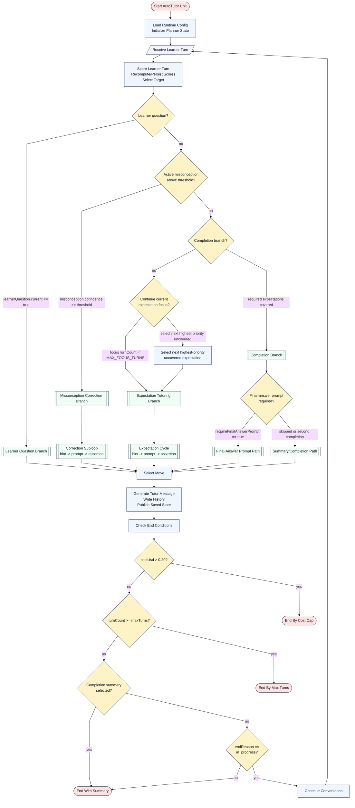

# MoFaCTS AutoTutor Algorithm State Machine

This document describes the AutoTutor algorithm as implemented in the local MoFaCTS checkout, not generic AutoTutor behavior. The canonical wiki path named in `AGENTS.md`, `C:\Users\ppavl\OneDrive\Active projects\mofacts.wiki`, was not present in this session, so this write-up is kept in the app repository rather than placed in or substituted for a wiki repo.

## Concise Lifecycle

An AutoTutor unit is selected when the session surface resolves to `autotutor`; the Svelte chat shell mounts `AutoTutorSession`, creates a runtime, loads authored unit configuration from the current TDF/unit and first stimulus in the configured cluster, reconstructs any saved history, publishes state to Meteor `Session`, and then handles each learner message through scoring, planning, utterance generation, history write, and state publication. Sources: `mofacts/client/views/experiment/svelte/services/sessionSurfaceMode.ts:95`, `mofacts/client/views/experiment/svelte/services/sessionSurfaceMode.ts:139`, `mofacts/client/views/experiment/svelte/components/AutoTutorSession.svelte:250`, `mofacts/client/views/experiment/svelte/services/autoTutorClient.ts:787`.

The component package declares the `autotutor` unit type, required runtime capabilities, typed state/history/end-state contracts, config interpretation, and planner helpers; app-owned code still provides the Svelte chat shell, Meteor session wiring, OpenRouter calls, canonical history compression/persistence, and resume loading. Sources: `learning-components/units/autotutor/README.md:3`, `learning-components/units/autotutor/README.md:17`, `learning-components/units/autotutor/manifest.ts:9`, `learning-components/units/autotutor/AutoTutorRuntimeCapabilities.ts:10`.

Each learner turn runs two OpenRouter calls unless cost termination prevents the second: a deterministic scoring call at fixed temperature, followed by an utterance call at configured tutor wording temperature. The app parses and validates both JSON envelopes, enforces target/move invariants, writes canonical history, mutates in-memory state, and publishes a summarized state. Sources: `mofacts/client/views/experiment/svelte/services/autoTutorClient.ts:824`, `mofacts/client/views/experiment/svelte/services/autoTutorClient.ts:853`, `mofacts/client/views/experiment/svelte/services/autoTutorClient.ts:880`, `mofacts/client/views/experiment/svelte/services/autoTutorClient.ts:892`, `mofacts/client/views/experiment/svelte/services/autoTutorClient.ts:900`.

## Flow Chart

The rendered SVG above is checked in at `docs-developer/assets/autotutor-flowchart.svg`; a PNG copy is checked in at `docs-developer/assets/autotutor-flowchart.png` for viewers that do not render SVG. The checked-in chart was rendered from Mermaid using the Dagre flowchart renderer after comparing TD/Dagre, TD/ELK, LR/Dagre, and LR/ELK. TD/Dagre kept the branch structure readable; TD/ELK duplicated the loop-entry path visually, and both LR layouts became too wide.

## State Machine Explanation

### Initialization

The runtime reads Meteor session values through `createMeteorAutoTutorRuntimeCapabilities`, including current user, TDF id/name, unit number, current TDF file, current unit, section, teacher, condition, and entry point. Missing `currentTdfId`, `currentTdfName`, or a non-negative `currentUnitNumber` fails with explicit errors rather than fallback values. Sources: `mofacts/client/views/experiment/svelte/services/autoTutorClient.ts:104`, `mofacts/client/views/experiment/svelte/services/autoTutorClient.ts:113`, `mofacts/client/views/experiment/svelte/services/autoTutorClient.ts:116`, `mofacts/client/views/experiment/svelte/services/autoTutorClient.ts:119`.

Initial state is built from `createInitialAutoTutorPlannerState`: every authored expectation starts with `current: false`, `coverage/frontier/coherence/centrality/priority: 0`; every authored misconception starts with `current: false`, `confidence: 0`; planner `focusTurnCount` and `moveCycleIndex` start at 0. Sources: `learning-components/units/autotutor/AutoTutorPlanner.ts:171`, `learning-components/units/autotutor/AutoTutorPlanner.ts:173`, `learning-components/units/autotutor/AutoTutorPlanner.ts:183`, `learning-components/units/autotutor/AutoTutorPlanner.ts:190`, `mofacts/client/views/experiment/svelte/services/autoTutorClient.ts:198`.

### Loading Authored Script And Runtime Config

Runtime config is read from the current unit's `autotutorsession`, the TDF tutor `setspec`, the client AI-provider capability, and the first stimulus in the configured cluster. Required invariants include `currentTdfFile.tdfs.tutor`, `currentTdfUnit.autotutorsession`, non-negative `autotutorsession.cluster`, a first stim at that cluster, `stim.autoTutor`, a client OpenRouter API key, an OpenRouter model from unit override or setspec, `display.text`, valid graduation, and a positive `maxTurns`. Sources: `learning-components/units/autotutor/AutoTutorRuntimeConfig.ts`, `mofacts/client/views/experiment/svelte/services/autoTutorClient.ts`.

Authored script validation requires script metadata, at least one expectation, non-empty expectation ids/labels/propositions/assertions, valid misconception ids/labels/corrections/repair questions, valid optional repair criteria and acceptable repair answers, and `dialogPolicy.requiredExpectations` referencing known expectation ids. Sources: `mofacts/common/lib/autoTutorContract.ts:71`, `mofacts/common/lib/autoTutorContract.ts:77`, `mofacts/common/lib/autoTutorContract.ts:83`, `mofacts/common/lib/autoTutorContract.ts:104`, `mofacts/common/lib/autoTutorContract.ts:142`.

### Scoring Learner Input

On submit, blank input is rejected by `requiredString`, completed sessions reject further turns, and a pre-existing cost total above the cap ends with `cost_cap` before scoring. Otherwise the app builds a score scope from expectations not yet covered, calls OpenRouter with the scoring system/user prompts, parses the score envelope, and validates that all scoreable expectations and all known misconceptions are present and no unknown ids are returned. Sources: `mofacts/client/views/experiment/svelte/services/autoTutorClient.ts:802`, `mofacts/client/views/experiment/svelte/services/autoTutorClient.ts:807`, `mofacts/client/views/experiment/svelte/services/autoTutorClient.ts:820`, `mofacts/client/views/experiment/svelte/services/autoTutorClient.ts:824`, `mofacts/client/views/experiment/svelte/services/autoTutorClient.ts:829`, `mofacts/client/views/experiment/svelte/services/autoTutorClient.ts:435`.

The score prompt tells the model to score only learner-generated text for expectation coverage, classify learner questions and contribution type, use active repair context for misconceptions, treat post-assertion restatement as learner knowledge when appropriate, and return JSON only. The app derives `frontier` and `priority`; the prompt says not to return those fields. Sources: `mofacts/client/views/experiment/svelte/services/autoTutorClient.ts:240`, `mofacts/client/views/experiment/svelte/services/autoTutorClient.ts:242`, `mofacts/client/views/experiment/svelte/services/autoTutorClient.ts:244`, `mofacts/client/views/experiment/svelte/services/autoTutorClient.ts:248`, `mofacts/client/views/experiment/svelte/services/autoTutorClient.ts:259`, `mofacts/client/views/experiment/svelte/services/autoTutorClient.ts:275`.

Score parsing requires JSON envelope fields for expectation scores, misconception scores, `answerQuality`, `learnerContribution`, and `learnerQuestion`; score values must be numbers from 0 to 1, and a misconception cannot be both `current` and `repaired`. Sources: `mofacts/common/lib/autoTutorContract.ts:278`, `mofacts/common/lib/autoTutorContract.ts:348`, `mofacts/common/lib/autoTutorContract.ts:381`, `mofacts/common/lib/autoTutorContract.ts:408`, `mofacts/common/lib/autoTutorContract.ts:420`, `mofacts/common/lib/autoTutorContract.ts:448`.

### Expectation Targeting

Expectation priority is deterministic: `frontier = coverage`, and `priority = 0.5 * frontier + 0.3 * coherence + 0.2 * centrality`, clamped to 0..1. Covered expectations are not rescored on later turns because `getScoreableExpectationIds` excludes scores at or above the coverage threshold. Sources: `learning-components/units/autotutor/AutoTutorPlanner.ts:273`, `learning-components/units/autotutor/AutoTutorPlanner.ts:285`, `learning-components/units/autotutor/AutoTutorPlanner.ts:286`, `learning-components/units/autotutor/AutoTutorPlanner.ts:331`, `learning-components/units/autotutor/AutoTutorPlanner.ts:337`.

If the learner is not asking a content question and no active misconception is selected, the planner completes when all required expectations are covered; otherwise it continues the current focused required expectation if it remains uncovered and either the contribution is low-agency or `focusTurnCount < 6`. If that focus cannot continue, it selects the uncovered required expectation with highest priority, breaking ties by lexicographic id. Sources: `learning-components/units/autotutor/AutoTutorPlanner.ts:499`, `learning-components/units/autotutor/AutoTutorPlanner.ts:507`, `learning-components/units/autotutor/AutoTutorPlanner.ts:514`, `learning-components/units/autotutor/AutoTutorPlanner.ts:519`, `learning-components/units/autotutor/AutoTutorPlanner.ts:440`, `learning-components/units/autotutor/AutoTutorPlanner.ts:456`.

### Misconception Targeting

A misconception is selected only when the learner contribution is not low-agency, the misconception is not repaired, `current` is true, and `confidence >= misconceptionThreshold`; the selected misconception is the active candidate with the highest confidence encountered by the loop. Low-agency turns bypass misconception targeting and remain in expectation tutoring. Sources: `learning-components/units/autotutor/AutoTutorPlanner.ts:470`, `learning-components/units/autotutor/AutoTutorPlanner.ts:485`, `learning-components/units/autotutor/AutoTutorPlanner.ts:487`, `learning-components/units/autotutor/AutoTutorPlanner.ts:489`, `learning-components/units/autotutor/AutoTutorPlanner.ts:494`.

Misconception state is preserved so a repaired misconception stays inactive with confidence 0 unless the latest score reintroduces it; a current misconception clears `repaired`, and a latest repair writes `repairEvidence`. Sources: `learning-components/units/autotutor/AutoTutorPlanner.ts:388`, `learning-components/units/autotutor/AutoTutorPlanner.ts:401`, `learning-components/units/autotutor/AutoTutorPlanner.ts:414`, `learning-components/units/autotutor/AutoTutorPlanner.ts:422`.

### Learner-Question Handling

The scorer separately returns `learnerQuestion.current` and `answerableFromAuthoredContent`, and the planner routes either `learnerContribution.type == "question"` or `learnerQuestion.current == true` to the learner-question target. That target always selects the `answer_question` move. Sources: `mofacts/common/lib/autoTutorContract.ts:536`, `learning-components/units/autotutor/AutoTutorPlanner.ts:481`, `learning-components/units/autotutor/AutoTutorPlanner.ts:530`.

The utterance prompt constrains the generated answer to authored content and dialogue context; for out-of-scope learner questions, the tutor should say it can only answer from lesson content and continue with the selected move. The planner currently does not branch on `answerableFromAuthoredContent`; that flag is declared and parsed, but the runtime behavior is prompt-level, not planner-level. Sources: `mofacts/client/views/experiment/svelte/services/autoTutorClient.ts:333`, `mofacts/common/lib/autoTutorContract.ts:536`, `learning-components/units/autotutor/AutoTutorPlanner.ts:48`, `learning-components/units/autotutor/AutoTutorPlanner.ts:481`.

### Move Selection

Target type determines the top-level move: learner question -> `answer_question`, misconception -> `correction`, completion -> `summary` or `final_answer_prompt`, expectation -> low-agency/quality/cycle logic. Sources: `learning-components/units/autotutor/AutoTutorPlanner.ts:530`, `learning-components/units/autotutor/AutoTutorPlanner.ts:532`, `learning-components/units/autotutor/AutoTutorPlanner.ts:535`, `learning-components/units/autotutor/AutoTutorPlanner.ts:541`, `learning-components/units/autotutor/AutoTutorPlanner.ts:552`.

For expectation moves, repeated `idk` or `help_request` escalates from `hint` to `prompt` to `assertion` as the contribution streak count reaches 1, 2, and 3. Other low-agency contribution types (`uncertainty`, `affect`, `meta`, `off_task`) select `hint`. Low answer quality on the first focus turn selects `pump`. Partial coverage near threshold, defined as `coverage >= coverageThreshold * 0.75` and `< coverageThreshold`, selects `prompt`. Otherwise the expectation cycle is `hint -> prompt -> assertion`. Sources: `learning-components/units/autotutor/AutoTutorPlanner.ts:557`, `learning-components/units/autotutor/AutoTutorPlanner.ts:563`, `learning-components/units/autotutor/AutoTutorPlanner.ts:572`, `learning-components/units/autotutor/AutoTutorPlanner.ts:575`, `learning-components/units/autotutor/AutoTutorPlanner.ts:578`, `learning-components/units/autotutor/AutoTutorPlanner.ts:581`.

### Correction Subloop

A misconception target always has selected move `correction`, and `planAutoTutorTurn` advances the correction subloop through `hint -> prompt -> assertion` using `misconceptionCycleIndex`. A new focused misconception resets `misconceptionCycleIndex` to 0. If the current target is not a misconception and no active misconception remains above threshold, `focusedMisconceptionId` and `misconceptionCycleIndex` are cleared. Sources: `learning-components/units/autotutor/AutoTutorPlanner.ts:127`, `learning-components/units/autotutor/AutoTutorPlanner.ts:535`, `learning-components/units/autotutor/AutoTutorPlanner.ts:629`, `learning-components/units/autotutor/AutoTutorPlanner.ts:633`, `learning-components/units/autotutor/AutoTutorPlanner.ts:637`, `learning-components/units/autotutor/AutoTutorPlanner.ts:640`.

The utterance layer receives `correctionStage` and prompt guidance that differentiates repair hints, prompts, and assertions, including a rule not to repeat the same repair question verbatim. Sources: `mofacts/client/views/experiment/svelte/services/autoTutorClient.ts:340`, `mofacts/client/views/experiment/svelte/services/autoTutorClient.ts:341`, `mofacts/client/views/experiment/svelte/services/autoTutorClient.ts:358`, `mofacts/client/views/experiment/svelte/services/autoTutorClient.ts:416`.

### Expectation Hint/Prompt/Assertion Cycle

When the planner stays on or selects an expectation target, it updates `focusedExpectationId`, `focusTurnCount`, and `moveCycleIndex`; a new expectation focus resets count and cycle index. If the selected move is `assertion`, the expectation score is marked `tutoredByAssertion` so the scorer can later evaluate learner restatement or application. Sources: `learning-components/units/autotutor/AutoTutorPlanner.ts:609`, `learning-components/units/autotutor/AutoTutorPlanner.ts:613`, `learning-components/units/autotutor/AutoTutorPlanner.ts:618`, `learning-components/units/autotutor/AutoTutorPlanner.ts:619`, `learning-components/units/autotutor/AutoTutorPlanner.ts:626`.

### Final-Answer Prompt Path

Completion target move selection depends on `requireFinalAnswerPrompt`: when false, completion selects `summary`; when true, the first completion target selects `final_answer_prompt`, and a subsequent completion target selects `summary` because `lastSelectedTargetType` is already `completion`. Sources: `learning-components/units/autotutor/AutoTutorPlanner.ts:541`, `learning-components/units/autotutor/AutoTutorPlanner.ts:542`, `learning-components/units/autotutor/AutoTutorPlanner.ts:545`, `learning-components/units/autotutor/AutoTutorPlanner.ts:602`.

Graduation is not applied immediately on the first final-answer prompt. The runtime marks mastery only when graduation is met and either the selected target is not completion or the completion move is `summary`; this is what lets the required final-answer prompt happen before mastery completion. Sources: `mofacts/client/views/experiment/svelte/services/autoTutorClient.ts:869`, `mofacts/client/views/experiment/svelte/services/autoTutorClient.ts:870`, `mofacts/client/views/experiment/svelte/services/autoTutorClient.ts:871`.

### Summary And Completion Path

Completion is a planner target when every required expectation id is covered at the coverage threshold. Runtime graduation is stricter or looser according to authored `graduation`: covered required expectation count must be at least `graduation.requiredExpectationCount`, and active misconceptions must be at most `graduation.maxActiveMisconceptions`. If graduation is met and the final-answer prompt gate is satisfied, the runtime applies end reason `mastery`. Sources: `learning-components/units/autotutor/AutoTutorPlanner.ts:499`, `mofacts/client/views/experiment/svelte/services/autoTutorClient.ts:591`, `mofacts/client/views/experiment/svelte/services/autoTutorClient.ts:602`, `mofacts/client/views/experiment/svelte/services/autoTutorClient.ts:869`, `learning-components/units/autotutor/AutoTutorEndState.ts:23`.

The end-state helper maps end reasons to flags: any non-`in_progress` reason sets `completed`, only `mastery` sets `mastered`, and only `cost_cap` sets `stoppedByCost`. History actions map to `autotutor-turn`, `autotutor-complete`, `autotutor-ended-max_turns`, or `autotutor-ended-cost_cap`. Sources: `learning-components/units/autotutor/AutoTutorEndState.ts:23`, `learning-components/units/autotutor/AutoTutorEndState.ts:27`, `learning-components/units/autotutor/AutoTutorEndState.ts:33`, `learning-components/units/autotutor/AutoTutorEndState.ts:36`.

### Max-Turn And Cost-Cap Termination

`maxTurns` is authored in `autotutorsession.maxTurns` and must be a positive integer. After scoring and planning, the runtime increments `turnCount`; if the cost cap has not already ended the turn and graduation is not applied, `turnCount >= config.turnLimit.maxTurns` applies `max_turns`. Sources: `learning-components/units/autotutor/AutoTutorRuntimeConfig.ts:133`, `mofacts/common/autoTutorFieldRegistry.ts:38`, `mofacts/client/views/experiment/svelte/services/autoTutorClient.ts:863`, `mofacts/client/views/experiment/svelte/services/autoTutorClient.ts:872`.

The cost cap is implemented in runtime code as `AUTO_TUTOR_COST_CAP_USD = 0.20`. The app requires every OpenRouter response to include `usage.cost`; without it, it throws because the cap cannot be enforced. Cost is checked before scoring using the current state, after scoring before utterance, and again after utterance; cost termination writes a fixed stop message and `cost_cap` end reason. Sources: `mofacts/client/views/experiment/svelte/services/autoTutorClient.ts:59`, `mofacts/client/views/experiment/svelte/services/autoTutorClient.ts:475`, `mofacts/client/views/experiment/svelte/services/autoTutorClient.ts:807`, `mofacts/client/views/experiment/svelte/services/autoTutorClient.ts:866`, `mofacts/client/views/experiment/svelte/services/autoTutorClient.ts:885`.

### History, Persistence, And Resume Reconstruction

Each turn writes one canonical history record with `levelUnitType: "autotutor"`, `eventType: "autotutor-turn"`, student input, tutor feedback text, display metadata, progress/end-state note in `CFNote`, and an action derived from the AutoTutor end state. Sources: `mofacts/client/views/experiment/svelte/services/autoTutorClient.ts:717`, `mofacts/client/views/experiment/svelte/services/autoTutorClient.ts:746`, `mofacts/client/views/experiment/svelte/services/autoTutorClient.ts:752`, `mofacts/client/views/experiment/svelte/services/autoTutorClient.ts:777`, `mofacts/client/views/experiment/svelte/services/autoTutorClient.ts:782`.

The app writes through `insertCompressedHistory`, which stamps the canonical history schema version, compresses stable fields, validates the wire payload, and calls Meteor `insertHistory`; the server decompresses, validates the canonical envelope, authorizes the write, sanitizes ownership, and inserts. Sources: `mofacts/client/lib/historyWire.ts:13`, `mofacts/client/lib/historyWire.ts:14`, `mofacts/client/lib/historyWire.ts:16`, `mofacts/client/lib/historyWire.ts:18`, `mofacts/server/methods/analyticsMethods.ts:380`, `mofacts/server/methods/analyticsMethods.ts:392`, `mofacts/server/methods/analyticsMethods.ts:406`, `mofacts/server/methods/analyticsMethods.ts:413`.

Resume loads rows from `getAutoTutorHistoryForUnit` scoped to the authenticated user, current TDF, unit number, `levelUnitType: "autotutor"`, and `eventType: "autotutor-turn"`, ordered by time and recorded server time. Reconstruction rebuilds dialogue from row input/response and feedback text, reads the latest `CFNote`, requires the saved `scriptId` to match the current script, validates top-level end state and saved state shape, then replaces current state fields from saved state. Sources: `mofacts/client/views/experiment/svelte/services/autoTutorClient.ts:670`, `mofacts/server/methods/analyticsMethods.ts:964`, `mofacts/server/methods/analyticsMethods.ts:969`, `mofacts/server/methods/analyticsMethods.ts:989`, `mofacts/client/views/experiment/svelte/services/autoTutorClient.ts:620`, `mofacts/client/views/experiment/svelte/services/autoTutorClient.ts:641`, `mofacts/client/views/experiment/svelte/services/autoTutorClient.ts:646`, `mofacts/client/views/experiment/svelte/services/autoTutorClient.ts:654`.

Saved `CFNote` is intentionally AutoTutor-specific and must not include `schemaVersion`; schema versioning is owned by the canonical history envelope, not the note payload. Sources: `learning-components/units/autotutor/AutoTutorSavedHistory.ts:32`, `learning-components/units/autotutor/AutoTutorSavedHistory.ts:44`, `learning-components/units/autotutor/AutoTutorSavedHistory.ts:47`, `learning-components/units/autotutor/README.md:34`.

## Planner State Values

| State value | Meaning and update rule | Sources |
| --- | --- | --- |
| `focusedExpectationId` | Current required expectation focus. Set when an expectation target changes; used to continue focus while uncovered and under focus-turn rules. | `learning-components/units/autotutor/AutoTutorPlanner.ts:60`, `learning-components/units/autotutor/AutoTutorPlanner.ts:507`, `learning-components/units/autotutor/AutoTutorPlanner.ts:613` |
| `focusedMisconceptionId` | Current misconception repair focus. Set when a misconception target changes; cleared when no active misconception remains above threshold. | `learning-components/units/autotutor/AutoTutorPlanner.ts:62`, `learning-components/units/autotutor/AutoTutorPlanner.ts:633`, `learning-components/units/autotutor/AutoTutorPlanner.ts:641` |
| `lastCoveredExpectationId` | Last expectation id encountered as covered while iterating previous expectation scores at plan time. | `learning-components/units/autotutor/AutoTutorPlanner.ts:63`, `learning-components/units/autotutor/AutoTutorPlanner.ts:649` |
| `lastSelectedTargetId` | Id of the last selected expectation or misconception target; deleted for id-less targets such as learner question or completion. | `learning-components/units/autotutor/AutoTutorPlanner.ts:64`, `learning-components/units/autotutor/AutoTutorPlanner.ts:602` |
| `lastSelectedTargetType` | Last selected target type: `expectation`, `misconception`, `learner_question`, or `completion`; drives final-answer prompt vs summary on completion. | `learning-components/units/autotutor/AutoTutorPlanner.ts:65`, `learning-components/units/autotutor/AutoTutorPlanner.ts:541`, `learning-components/units/autotutor/AutoTutorPlanner.ts:602` |
| `focusTurnCount` | Count of consecutive turns on the current expectation focus. Reset when focus changes; incremented for expectation targets; continuation allowed while below `MAX_FOCUS_TURNS` unless low-agency. | `learning-components/units/autotutor/AutoTutorPlanner.ts:66`, `learning-components/units/autotutor/AutoTutorPlanner.ts:129`, `learning-components/units/autotutor/AutoTutorPlanner.ts:514`, `learning-components/units/autotutor/AutoTutorPlanner.ts:615` |
| `moveCycleIndex` | Index into expectation cycle `hint -> prompt -> assertion`. Reset on new expectation focus; incremented on expectation target planning. | `learning-components/units/autotutor/AutoTutorPlanner.ts:67`, `learning-components/units/autotutor/AutoTutorPlanner.ts:127`, `learning-components/units/autotutor/AutoTutorPlanner.ts:581`, `learning-components/units/autotutor/AutoTutorPlanner.ts:616` |
| `misconceptionCycleIndex` | Index into misconception correction cycle `hint -> prompt -> assertion`. Reset on new misconception focus; incremented on misconception targets. | `learning-components/units/autotutor/AutoTutorPlanner.ts:68`, `learning-components/units/autotutor/AutoTutorPlanner.ts:128`, `learning-components/units/autotutor/AutoTutorPlanner.ts:635`, `learning-components/units/autotutor/AutoTutorPlanner.ts:637` |
| `contributionStreakType` | Most recent learner contribution type for streak tracking. Updated when learner contribution exists; deleted otherwise. | `learning-components/units/autotutor/AutoTutorPlanner.ts:69`, `learning-components/units/autotutor/AutoTutorPlanner.ts:591`, `learning-components/units/autotutor/AutoTutorPlanner.ts:599` |
| `contributionStreakCount` | Consecutive count for the current contribution type. Used for repeated `idk`/help escalation. | `learning-components/units/autotutor/AutoTutorPlanner.ts:70`, `learning-components/units/autotutor/AutoTutorPlanner.ts:558`, `learning-components/units/autotutor/AutoTutorPlanner.ts:592` |
| `expectationScores` | Record of expectation coverage, evidence, missing elements, assertion uptake flags, frontier, coherence, centrality, and priority. Validated against authored expectation ids. | `learning-components/units/autotutor/AutoTutorPlanner.ts:27`, `learning-components/units/autotutor/AutoTutorPlanner.ts:71`, `learning-components/units/autotutor/AutoTutorPlanner.ts:198`, `learning-components/units/autotutor/AutoTutorSavedState.ts:46` |
| `misconceptionScores` | Record of misconception current/confidence/evidence/repaired/repairEvidence. Validated against authored misconception ids. | `learning-components/units/autotutor/AutoTutorPlanner.ts:40`, `learning-components/units/autotutor/AutoTutorPlanner.ts:72`, `learning-components/units/autotutor/AutoTutorPlanner.ts:226`, `learning-components/units/autotutor/AutoTutorSavedState.ts:94` |

## Transition Conditions

| Condition | Implemented transition | Sources |
| --- | --- | --- |
| Learner question detected | `learnerContribution.type == "question"` or `learnerQuestion.current == true` selects target `learner_question`, move `answer_question`. | `learning-components/units/autotutor/AutoTutorPlanner.ts:481`, `learning-components/units/autotutor/AutoTutorPlanner.ts:532` |
| Active misconception above threshold | If not low-agency, unrepaired current misconception with confidence at least threshold selects target `misconception`, move `correction`. | `learning-components/units/autotutor/AutoTutorPlanner.ts:485`, `learning-components/units/autotutor/AutoTutorPlanner.ts:489`, `learning-components/units/autotutor/AutoTutorPlanner.ts:535` |
| All required expectations covered | Planner selects target `completion`. Runtime mastery still depends on graduation and final-answer prompt gate. | `learning-components/units/autotutor/AutoTutorPlanner.ts:499`, `learning-components/units/autotutor/AutoTutorPlanner.ts:503`, `mofacts/client/views/experiment/svelte/services/autoTutorClient.ts:869` |
| Continuing current expectation focus | If focused expectation is required, uncovered, and low-agency or `focusTurnCount < MAX_FOCUS_TURNS`, continue the same expectation. | `learning-components/units/autotutor/AutoTutorPlanner.ts:507`, `learning-components/units/autotutor/AutoTutorPlanner.ts:514` |
| Selecting next highest-priority uncovered expectation | If no question/misconception/completion/continuing focus applies, choose highest-priority uncovered required expectation, excluding current focus first. | `learning-components/units/autotutor/AutoTutorPlanner.ts:519`, `learning-components/units/autotutor/AutoTutorPlanner.ts:440`, `learning-components/units/autotutor/AutoTutorPlanner.ts:461` |
| Low-agency contribution handling | `idk`, `help_request`, `uncertainty`, `affect`, `meta`, and `off_task` are low-agency; low-agency bypasses misconception selection and can keep current expectation focus. | `learning-components/units/autotutor/AutoTutorPlanner.ts:470`, `learning-components/units/autotutor/AutoTutorPlanner.ts:485`, `learning-components/units/autotutor/AutoTutorPlanner.ts:514` |
| Repeated `idk` / help-request escalation | Same-type streak: first `hint`, second `prompt`, third and later `assertion`. | `learning-components/units/autotutor/AutoTutorPlanner.ts:558`, `learning-components/units/autotutor/AutoTutorPlanner.ts:563`, `learning-components/units/autotutor/AutoTutorPlanner.ts:567` |
| Partial coverage near threshold | If `coverage >= coverageThreshold * 0.75` and below threshold, select `prompt`. With default threshold 0.8, this starts at 0.6. | `learning-components/units/autotutor/AutoTutorPlanner.ts:116`, `learning-components/units/autotutor/AutoTutorPlanner.ts:578` |
| Final-answer prompt required vs skipped | Completion target selects `summary` when `requireFinalAnswerPrompt` is false; otherwise first completion target selects `final_answer_prompt`, next completion target selects `summary`. | `learning-components/units/autotutor/AutoTutorPlanner.ts:541`, `learning-components/units/autotutor/AutoTutorPlanner.ts:545` |
| Cost cap | If cost exceeds 0.20 before scoring, after scoring, or after utterance, set `cost_cap`; OpenRouter responses without `usage.cost` fail. | `mofacts/client/views/experiment/svelte/services/autoTutorClient.ts:60`, `mofacts/client/views/experiment/svelte/services/autoTutorClient.ts:807`, `mofacts/client/views/experiment/svelte/services/autoTutorClient.ts:866`, `mofacts/client/views/experiment/svelte/services/autoTutorClient.ts:885` |
| Max turns | After turn increment and absent mastery/cost termination, `turnCount >= maxTurns` sets `max_turns`. | `mofacts/client/views/experiment/svelte/services/autoTutorClient.ts:863`, `mofacts/client/views/experiment/svelte/services/autoTutorClient.ts:872` |

## Thresholds, Defaults, And Authored Runtime Settings

| Setting | Current implementation | Sources |
| --- | --- | --- |
| Coverage threshold | Default `0.8`; used for covered expectations, score-freezing, planner completion, and progress count. No TDF field currently overrides it in `readAutoTutorConfig`. | `learning-components/units/autotutor/AutoTutorPlanner.ts:116`, `learning-components/units/autotutor/AutoTutorPlanner.ts:153`, `learning-components/units/autotutor/AutoTutorPlanner.ts:331`, `mofacts/client/views/experiment/svelte/services/autoTutorClient.ts:578` |
| Misconception threshold | Default `0.65`; used by planner targeting. Runtime progress and graduation counting also hard-code `0.65` rather than reading a config field. | `learning-components/units/autotutor/AutoTutorPlanner.ts:116`, `learning-components/units/autotutor/AutoTutorPlanner.ts:487`, `mofacts/client/views/experiment/svelte/services/autoTutorClient.ts:572`, `mofacts/client/views/experiment/svelte/services/autoTutorClient.ts:585` |
| Priority weights | Defaults are `frontierWeight 0.5`, `coherenceWeight 0.3`, `centralityWeight 0.2`; parser and planner both compute this formula. No TDF field currently overrides weights in runtime. | `learning-components/units/autotutor/AutoTutorPlanner.ts:121`, `learning-components/units/autotutor/AutoTutorPlanner.ts:286`, `mofacts/common/lib/autoTutorContract.ts:348` |
| `maxTurns` | Authored as `autotutorsession.maxTurns`, default editor field value 20, runtime requires positive integer, termination condition uses `turnCount >= maxTurns`. | `mofacts/common/autoTutorFieldRegistry.ts:38`, `learning-components/units/autotutor/AutoTutorRuntimeConfig.ts:133`, `mofacts/client/views/experiment/svelte/services/autoTutorClient.ts:872` |
| `requireFinalAnswerPrompt` | Authored boolean default false. Runtime stores `true` only when field is exactly `true`; planner uses it for completion move selection. | `mofacts/common/autoTutorFieldRegistry.ts:34`, `learning-components/units/autotutor/AutoTutorRuntimeConfig.ts:174`, `learning-components/units/autotutor/AutoTutorPlanner.ts:541` |
| `graduation` | Authored object with `requiredExpectationCount` and `maxActiveMisconceptions`; runtime validates non-negative integers and bounds against required expectations and authored misconceptions. | `mofacts/common/autoTutorFieldRegistry.ts:42`, `learning-components/units/autotutor/AutoTutorRuntimeConfig.ts:108`, `learning-components/units/autotutor/AutoTutorRuntimeConfig.ts:196` |
| OpenRouter API key | Required from the client AI-provider capability, backed by Profile browser storage. It is not required or stored in TDF content. | `learning-components/units/autotutor/AutoTutorRuntimeConfig.ts`, `mofacts/client/views/experiment/svelte/services/autoTutorClient.ts` |
| OpenRouter model | Unit `autotutorsession.openRouterModel` overrides `tutor.setspec.openRouterModel`; one of them is required. | `mofacts/common/lib/autoTutorContract.ts:225`, `learning-components/units/autotutor/AutoTutorRuntimeConfig.ts:166`, `mofacts/common/autoTutorFieldRegistry.ts:14` |
| Scoring temperature | Fixed at `0.2`; not authored in TDF. | `learning-components/units/autotutor/AutoTutorGenerationConfig.ts:1`, `mofacts/client/views/experiment/svelte/services/autoTutorClient.ts:547` |
| Utterance temperature | Authored `autotutorsession.utteranceTemperature`, default `0.45`, valid range 0..2. | `learning-components/units/autotutor/AutoTutorGenerationConfig.ts:2`, `learning-components/units/autotutor/AutoTutorGenerationConfig.ts:4`, `learning-components/units/autotutor/AutoTutorRuntimeConfig.ts:167`, `mofacts/common/autoTutorFieldRegistry.ts:18` |
| OpenRouter request | Calls `https://openrouter.ai/api/v1/chat/completions` with model, messages, temperature, `stream: false`, referer, and title headers. | `mofacts/client/views/experiment/svelte/services/autoTutorClient.ts:59`, `mofacts/client/views/experiment/svelte/services/autoTutorClient.ts:509`, `mofacts/client/views/experiment/svelte/services/autoTutorClient.ts:514`, `mofacts/client/views/experiment/svelte/services/autoTutorClient.ts:522` |

## Current Boundaries

Component-owned AutoTutor logic currently lives under `learning-components/units/autotutor/`. It owns unit registration for `autotutor`, capability contracts, end-state semantics, generation-temperature constants, authored config interpretation, saved-history and saved-state validation, and planner scoring/target/move helpers. Sources: `learning-components/units/autotutor/README.md:5`, `learning-components/units/autotutor/README.md:9`, `learning-components/units/autotutor/README.md:10`, `learning-components/units/autotutor/README.md:11`, `learning-components/units/autotutor/README.md:12`, `learning-components/units/autotutor/README.md:15`.

App-owned wiring remains in Svelte/Meteor code. The app owns the `deep-chat` shell, browser OpenRouter calls, Meteor session snapshot/state publication, canonical history envelope validation/compression/persistence, server history methods, and resume reconstruction. Sources: `learning-components/units/autotutor/README.md:17`, `mofacts/client/views/experiment/svelte/components/AutoTutorSession.svelte:3`, `mofacts/client/views/experiment/svelte/services/autoTutorClient.ts:104`, `mofacts/client/views/experiment/svelte/services/autoTutorClient.ts:509`, `mofacts/client/lib/historyWire.ts:13`, `mofacts/server/methods/analyticsMethods.ts:964`.

Declared but not fully wired as independent planner behavior: `learnerQuestion.answerableFromAuthoredContent` is parsed and included in prompts, but target/move selection only tests whether a learner question is current; coverage and misconception thresholds/weights are planner defaults and hard-coded runtime counts, not authored runtime fields; `feedback` and `question_prompt` are valid move enum values but no local planner branch currently selects them. Sources: `learning-components/units/autotutor/AutoTutorPlanner.ts:1`, `learning-components/units/autotutor/AutoTutorPlanner.ts:48`, `learning-components/units/autotutor/AutoTutorPlanner.ts:116`, `learning-components/units/autotutor/AutoTutorPlanner.ts:121`, `learning-components/units/autotutor/AutoTutorPlanner.ts:530`, `mofacts/client/views/experiment/svelte/services/autoTutorClient.ts:572`.
